<a name="top"></a>

# Hector OOTP Analyzer

Hector is a powerful and fully customizable desktop analytics tool for Out of the Park Baseball (OOTP) leagues. Built for both casual GMs and competitive online leagues, Hector imports your exported HTML data and delivers clear, actionable insights with a dark-mode UI. Get in-depth, sortable breakdowns for every player and team, intelligent highlights, advanced filters, and direct Stats+ integration—helping you evaluate talent, find hidden gems, and make smart roster moves.

---

## Fork Overview

This is a fork of [zab1996/HectorOOTP](https://github.com/zab1996/HectorOOTP) that adds several new features:

- **Stats-Based Evaluation**: Evaluate players based on actual performance stats (wRC+, WAR, ERA+, FIP, etc.) instead of just ratings
- **Trade Analysis Tools**: Find trade targets with the Trade Finder tab - identify expiring veterans to sell and high-upside prospects to buy
- **Contract Value Analysis**: Evaluate contract efficiency with $/WAR calculations, surplus value, and contract categories (Surplus, Albatross, Arb Target)
- **Autocontract Generator**: Generate realistic competing contract offers for free agents with market-derived valuations, team archetypes, and customizable settings
- **Platoon Finder**: Identify platoon opportunities by matching L/R batters at same positions, find DH candidates, and highlight platoon-proof switch hitters
- **Trade Value Calculator**: Composite 1-100 trade value score for every player based on current production, future value, contract value, and position scarcity
- **Percentile Rankings**: See where any player ranks league-wide for every meaningful metric with visual percentile bars
- **Hidden Gems Finder**: Discover overlooked players across the league in categories like AAAA players, late bloomers, miscast players, and more
- **Franchise Archetypes**: Filter and find players that fit your desired team-building philosophy (Speed & Defense, Mashers, Moneyball, etc.)
- **Roster Builder Sandbox**: Build hypothetical rosters by selecting players from any team - full GM simulation mode
- **Auto-Generate Rosters**: Automatically build complete teams with randomized player selection based on competitive level, budget, and team identity preferences
- **Mac Compatible**: Can run from source with Python on macOS (see [Running on Mac](#running-on-mac))

---

## Table of Contents

- [Fork Overview](#fork-overview)
- [Downloading the Latest Version](#downloading-the-latest-version)
- [Running on Mac](#running-on-mac)
- [Flexible Weighting System](#flexible-weighting-system)
- [Stats-Based Scoring](#stats-based-scoring)
- [Percentile Rankings](#percentile-rankings)
- [Hidden Gems Finder](#hidden-gems-finder)
- [Franchise Archetypes](#franchise-archetypes)
- [Roster Builder](#roster-builder)
  - [Auto-Generate Teams](#auto-generate-teams)
- [Trade Finder Tab](#trade-finder-tab)
- [Contract Value Tab](#contract-value-tab)
- [Autocontract Generator](#autocontract-generator)
- [Platoon Finder Tab](#platoon-finder-tab)
- [Trade Value Calculator](#trade-value-calculator)
- [Age Definitions](#age-definitions)
- [Stat Columns Used](#stat-columns-used)
- [Hector Data Export Instructions](#hector-data-export-instructions)
- [Features Overview](#features-overview)
  - [Core Functionality](#core-functionality)
  - [User Interface Features](#user-interface-features)
  - [Reporting and Analysis Tools](#reporting-and-analysis-tools)
  - [Dataset Overview](#dataset-overview)
  - [User Assistance](#user-assistance)
- [Calculation Flowcharts](#calculation-flowcharts)

---

## Downloading the Latest Version

Download the newest build of Hector from the **Releases** page:

➡️ [**Download the latest version here**](../../releases)

1. Download the ZIP for the latest release.
2. Extract it to a folder of your choice.
3. Run the executable (or use Python if running from source).

<details>
<summary><strong>Showcase: Click to view screenshots of Hector in action</strong></summary>


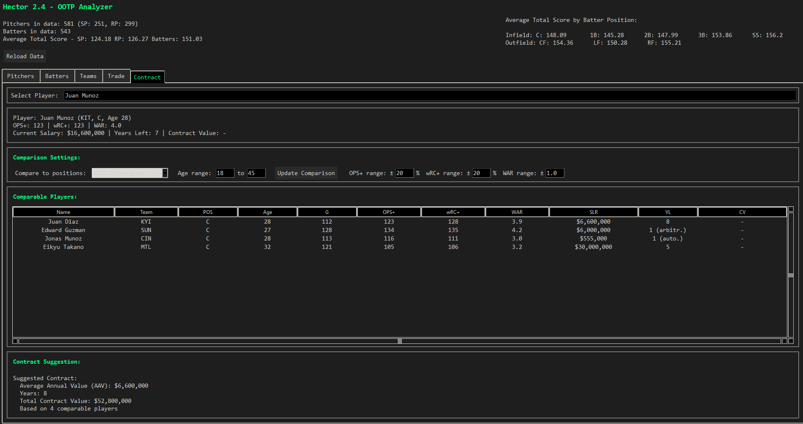
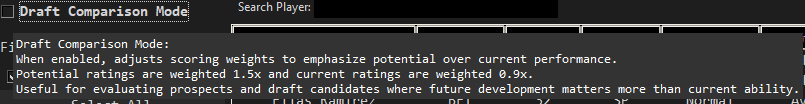
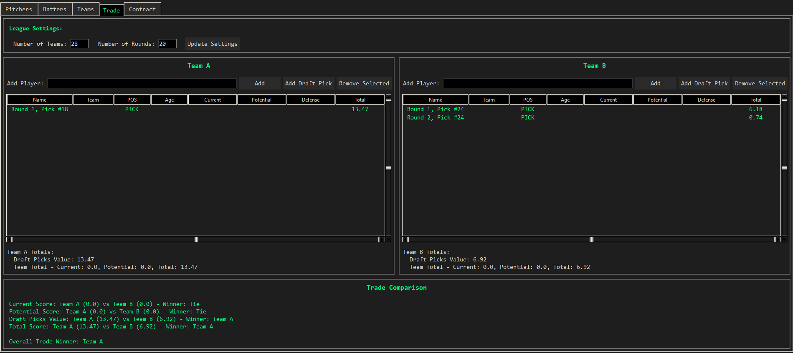

</details>

---

## Running on Mac
[⬆️ Back to Top](#top)

Hector can run from source on macOS:

1. Clone the repository:
   ```bash
   git clone https://github.com/quarterback/HectorOOTP.git
   ```

2. Navigate to the source code directory:
   ```bash
   cd "HectorOOTP/Hector 2.5 Source Code"
   ```

3. Install dependencies:
   ```bash
   pip3 install pandas beautifulsoup4
   ```

4. Run Hector:
   ```bash
   python3 main.py
   ```

> **Note:** `tkinter` comes built-in with Python on macOS.

---

## Flexible Weighting System
[⬆️ Back to Top](#top)

**Editing Player Weights**

- `pitcher_weights.py`: Set importance of pitching attributes
- `batter_weights.py`: Set importance of hitting/defense/baserunning

How to adjust the weights:

1. Open `pitcher_weights.py` or `batter_weights.py` in a text editor (e.g., Notepad++, VS Code, or TextEdit on Mac).
2. Modify values in the `section_weights` dictionary — higher = more influence on the score.
3. Save your changes in the program folder alongside the `.exe` (or in the source directory on Mac).
4. In Hector, click the **Reload Data** button to apply changes immediately.

---

## Stats-Based Scoring
[⬆️ Back to Top](#top)

Hector includes a stats-based scoring system that evaluates players on actual performance rather than ratings.

**How to Enable:**
- Check the "Use Stats-Based Scoring" toggle in the Pitchers or Batters tab

**How It Works:**
- Calculates player value using real performance stats instead of scout ratings
- Provides a more accurate picture of current production
- Especially useful for evaluating MLB-level players with established track records

**Batter Stats Used:**
- **wRC+** (Weighted Runs Created Plus) - Primary offensive value metric (30% weight)
- **WAR** (Wins Above Replacement) - Overall value (30% weight)
- **OPS+** (OPS Plus) - Park-adjusted OPS (15% weight)
- **G** (Games) - Sample size indicator (5% weight)

**Pitcher Stats Used:**
- **WAR** (Wins Above Replacement) - Overall value (30% weight)
- **ERA+** (ERA Plus) - Park-adjusted ERA, higher is better (30% weight)
- **rWAR** (Replacement-level WAR) - (15% weight)
- **HLD** (Holds) - Reliever value indicator (5% weight, RP/CL only)
- **IP** (Innings Pitched) - Workload indicator (5% weight)

**Automatic Fallback to Ratings:**
Players with limited sample sizes automatically use ratings-only scoring:
- **Batters**: Less than 50 games → uses ratings only
- **Pitchers**: Less than 20 IP → uses ratings only

**Configuring Weights:**
- Edit `batter_stat_weights.py` for batter stat weights and thresholds
- Edit `pitcher_stat_weights.py` for pitcher stat weights and thresholds

---

## Percentile Rankings
[⬆️ Back to Top](#top)

The Percentile Rankings feature shows where any player ranks league-wide for every meaningful metric, providing instant context for player evaluation.

### Metrics Calculated

**Batters:**
- Stats: wRC+, WAR, OPS+, OPS, wOBA, AVG, OBP, SLG, ISO, BB%, SO% (inverse)
- Ratings: CON, POW, EYE, SPE, OVR, POT

**Pitchers:**
- Stats: WAR, ERA+, FIP (inverse), FIP- (inverse), SIERA (inverse), K/9, BB/9 (inverse), HR/9 (inverse)
- Ratings: STU, MOV, CON, OVR, POT

### Percentile Tiers

| Percentile | Tier | Icon |
|------------|------|------|
| 90-100 | Elite | 💎 |
| 70-89 | Above Average | ⭐ |
| 40-69 | Average | ✅ |
| 20-39 | Below Average | 📉 |
| 0-19 | Poor | ❌ |

### Visual Display

Percentiles are shown with visual bars and tier indicators:
```
   wRC+ 176.0 | 98th | ████████████████████ 💎 Elite
    WAR   7.6 | 99th | ████████████████████ 💎 Elite  
    POW  60.0 | 75th | ███████████████░░░░░ ⭐ Above Avg
    SPE  60.0 | 70th | ██████████████░░░░░░ ⭐ Above Avg
```

### Usage

Percentile data is calculated automatically when data is loaded. Right-click on any player to view their full percentile breakdown in a player card popup.

### Player Card Popup

Right-click (or Ctrl+click on Mac) on any player row in any table throughout the application to view a detailed player card:

- **Header**: Player name, team, position, age, handedness
- **OVR/POT**: Current overall and potential ratings
- **Percentile Rankings**: Visual bars showing where the player ranks for each stat (90th+ = Elite, 75-89 = Good, etc.)
- **Best/Worst Stats**: Quick summary of the player's strongest and weakest percentile rankings
- **Archetype Fits**: Shows which team-building archetypes the player fits and their fit scores

This feature works in all tabs with player tables: Batters, Pitchers, Hidden Gems, Trade Tab, Trade Finder, Trade Builder, Contract, Contract Value, Roster Builder, and Platoon Finder.

---

## Hidden Gems Finder
[⬆️ Back to Top](#top)

The Hidden Gems tab helps find overlooked players across the league who deserve a second look.

### Categories

| Category | Icon | Criteria |
|----------|------|----------|
| **AAAA Players** | 📦 | OVR 45-55, good stats (wRC+ ≥100 or ERA+ ≥100), could start elsewhere |
| **Late Bloomers** | 🌸 | Age 26-28, OVR close to POT, still has upside (POT - OVR ≥ 5) |
| **Miscast Players** | 🎯 | Good bat, poor defense at premium position (C, SS, CF) |
| **Undervalued Veterans** | 👴 | Age 30+, still producing (wRC+/ERA+ ≥95), cheap/expiring contract |
| **Toolsy Gambles** | 🎰 | 1-2 elite tools (65+), other ratings mediocre, age ≤27 |
| **Reliever Converts** | 🔄 | Listed as SP, low stamina (<45), good stuff or movement (≥55) |

### Usage

1. Navigate to the **Hidden Gems** tab
2. Select a category from the dropdown or click on a category card
3. Optionally filter by position
4. Optionally filter by archetype to find players matching your team-building philosophy
5. Right-click any player to view their detailed player card
6. Double-click any player to open their Stats+ page

---

## Franchise Archetypes
[⬆️ Back to Top](#top)

Franchise Archetypes help you find players that fit your desired team-building philosophy.

### Available Archetypes

#### Traditional Archetypes

| Archetype | Icon | Description |
|-----------|------|-------------|
| **Speed & Defense** | 🏃 | High SPE (≥60), high STE (≥60), elite DEF, contact-oriented |
| **Mashers** | 💪 | High POW (≥60), high ISO (≥.180), corner positions |
| **Moneyball** | 👁️ | High EYE (≥55), high BB% (≥10%), wOBA ≥.340 |
| **Youth Movement** | 🌱 | Age ≤25, high POT (≥60), POT > OVR by ≥10, cheap contracts |
| **Win Now** | 🏆 | High OVR (≥65), high current stats, age 26-32 |
| **Budget Build** | 💰 | High WAR/$ ratio, pre-arb or arbitration, AAV <$5M |
| **Balanced** | ⚖️ | No glaring weaknesses, all ratings ≥45 |

#### Unconventional Archetypes

| Archetype | Icon | Description | Key Criteria |
|-----------|------|-------------|--------------|
| **Chaos Ball** | 🎲 | High variance boom-or-bust | High K% + high ISO, high power, low contact |
| **Small Ball** | ⚾ | Contact, bunting, manufacturing runs | Low K%, high STE, high CON, good bunting |
| **Ace Hunter** | 🎯 | Build around elite SP | Target elite SP (OVR 70+), stuff ≥70 |
| **Bullpen-First** | 🔥 | Elite relievers over rotation | Strong RP/CL focus, high stuff |
| **Platoon Army** | 🔄 | Maximize L/R platoon advantages | Players with big L/R splits, platoon-range OVR |
| **Launch Angle Era** | 🚀 | Three true outcomes only | High HR, BB, K - ignore AVG/contact |
| **Defense Wins** | 🛡️ | Elite defense priority | Premium positions (C, SS, CF), accept weaker bats |
| **Prospect Pipeline** | 🌾 | Perpetual rebuild, always flipping | Age ≤24, high POT, POT-OVR gap ≥15 |
| **Veteran Presence** | 👨‍🦳 | Experienced leadership roster | Age 30+, high OVR, proven production |
| **Innings Eaters** | 🍽️ | High stamina, durable pitchers | STM ≥60, durable health status, SP only |

### Fit Scores

Each player receives a fit score (0-100) for each archetype:
- **80-100**: Perfect fit
- **60-79**: Good fit
- **40-59**: Partial fit
- **Below 40**: Not a fit

### Using Archetypes

Archetypes are integrated throughout the tool:

1. **Player Card Popup**: Right-click (or Ctrl+click) any player in any table to see their full percentile breakdown and archetype fits
2. **Roster Builder**: Auto-detects the best archetype fit for your constructed roster
3. **Hidden Gems Tab**: Filter hidden gems by best-fit archetype
4. **Trade Finder Tab**: Filter surplus value players by archetype to find targeted trade fits

---

## Roster Builder
[⬆️ Back to Top](#top)

The Roster Builder Sandbox allows you to build hypothetical rosters by selecting players from any team - full GM simulation mode.

### Layout

**Player Pool (Left Panel)**
- Search players by name
- Filter by position
- Filter by team
- Shows OVR and WAR for each player
- Click to add to roster

**Your Roster (Center Panel)**
- Lineup: 9 positional slots (C, 1B, 2B, 3B, SS, LF, CF, RF, DH)
- Bench: 4 spots
- Rotation: 5 SP spots
- Bullpen: 7 RP spots

**Team Summary (Right Panel)**
- Total projected WAR
- Total salary commitment
- Average age
- Average OVR
- Position group grades (A+ to F)
- Auto-detected archetype fit

### Position Grades

| Grade | Criteria |
|-------|----------|
| A+ | OVR ≥ 80 (best in league) |
| A | OVR ≥ 70 (top 10%) |
| B+ | OVR ≥ 65 (top 25%) |
| B | OVR ≥ 60 (above average) |
| C | OVR ≥ 55 (average) |
| D | OVR ≥ 50 (below average) |
| F | OVR < 50 (major weakness) |

### Usage

1. Navigate to the **Roster Builder** tab
2. Use filters to find players in the Player Pool
3. Double-click a player to add them to your roster
4. View team summary and position grades on the right
5. Click "Clear Roster" to start over

### Auto-Generate Teams

The Roster Builder includes an auto-generate feature that builds complete rosters using weighted randomness - each generation produces a different, plausible team.

**Specification Options:**

| Option | Choices | Description |
|--------|---------|-------------|
| **Competitive Level** | Contender / Middle of the pack / Rebuilding | Contender favors high OVR, Middle of the pack uses balanced weights, Rebuilding favors youth and upside |
| **Salary Tier** | Big spender / Mid-market / Budget | Controls salary preferences for player selection |
| **Team Identity** | Any / Power-focused / Speed-focused / Pitching-focused / Youth-focused / Budget-focused / OBP-focused | Boosts players matching the selected archetype |

**How It Works:**
- Click "🎲 Generate!" to create a randomized team based on your preferences
- Clicking again with the same settings produces a **different** team each time
- Uses weighted random selection with guardrails to keep rosters realistic
- Fills all roster slots: 9 lineup positions, 4 bench spots, 5-man rotation, and 7-man bullpen
- Players matching your selected identity/archetype receive higher selection weights

**Example UI Dropdowns:**
```
Competitive Level: [Contender ▼]
Salary Tier:       [Mid-market ▼]
Team Identity:     [Power-focused ▼]

[🎲 Generate!]  [Clear Roster]
```

---

## Trade Finder Tab
[⬆️ Back to Top](#top)

The Trade Finder tab helps identify trade targets and assets. It displays two panels:

### 📤 Expiring Veterans (Sell High)
Find productive veterans on expiring contracts to trade for prospects:
- **Age**: 27 or older
- **Years Left (YL)**: 1 year or less remaining
- **Production**: Currently producing (configurable minimum WAR)
- Displays wRC+ for batters, ERA+ for pitchers

### 📥 High-Upside Prospects (Buy Low)
Find young players with significant development upside:
- **Age**: 25 or under
- **Potential Gap**: POT - OVR ≥ 15 (configurable)
- Shows OVR, POT, and the gap between them

**Features:**
- Sortable tables by clicking column headers
- Position filters for both panels
- Adjustable thresholds for WAR and potential gap
- Double-click to open player's Stats+ page

---

## Trade Builder Tab
[⬆️ Back to Top](#top)

The Trade Builder tab provides an interactive interface for building and evaluating trades with park-adjusted player ratings and multiple trade matching modes.

### Three-Panel Layout

**Left Panel: Your Trade Assets**
- Team selector dropdown to choose your team
- Player list showing all players from selected team with:
  - Name, Position, Age, OVR, Salary, Years Left
  - Surplus Value (WAR-based value vs. salary)
  - Park-Adjusted Rating bonus
- Click players to select them for trading
- Running total of trade value offered

**Right Panel: Trade Targets / Search Results**
- Filter controls:
  - Position filter (All, SP, RP, C, 1B, 2B, 3B, SS, LF, CF, RF, DH)
  - Age range (min/max)
  - Team Status (All, Sellers, Buyers, Neutral)
  - Minimum OVR
- Trade Mode selection:
  - ⚖️ **Fair Trade**: Returns players of equal value (±10% tolerance)
  - 📈 **Buy Low**: Prioritizes undervalued players from seller teams
  - 🎰 **Fleece Mode**: Returns players where you gain significant value (for fun)
- Results list with match percentage and value comparison
- Click players to add them to your receiving list

**Bottom Panel: Trade Summary**
- Side-by-side comparison of players being traded
- Trade Grade (A+ to F) based on value differential:
  - A+: You gain 30%+ value
  - A: You gain 15-30%
  - B: Roughly fair (±15%)
  - C: You lose 15-30%
  - D: You lose 30-50%
  - F: You lose 50%+
- Park Factor Impact Preview showing projected stat changes

### Park-Adjusted Player Ratings

The Trade Builder includes park factor adjustments to player evaluation:

**For Batters:**
- Power scores adjusted using PF HR from team data
- Contact/batting scores adjusted using PF AVG
- Formula: `adjusted_score = raw_score * (1 / park_factor)`
- Players in pitcher-friendly parks get boosted adjusted ratings

**For Pitchers:**
- Inverse logic - pitchers in hitter-friendly parks get boosted ratings
- Adjusted using overall PF factor
- Formula: `adjusted_score = raw_score * park_factor`

### Hidden Gems Integration

The Buy Low trade mode surfaces hidden gems automatically:

**Hidden Gem Criteria:**
- Plays in extreme pitcher park (PF < 0.95 or PF HR < 0.90) for batters
- Plays in extreme hitter park (PF > 1.05 or PF HR > 1.10) for pitchers
- Has good raw power/contact/stuff being suppressed
- On a seller team (more likely available via trade)
- Good surplus value (underpaid relative to production)

Hidden gems are highlighted with a 💎 indicator and prioritized in Buy Low mode.

### Trade Value Calculation

The comprehensive trade value includes:
```
trade_value = (
    base_surplus_value           # WAR-based, from existing calculation
    + park_adjustment_bonus      # Value added if in suppressive park
    + age_adjustment             # Young players worth more
    + contract_value             # Years of control, salary efficiency
)
```

---

## Contract Value Tab
[⬆️ Back to Top](#top)

The Contract Value tab helps evaluate whether players provide good value relative to their salary. Useful for long-term roster building and identifying value opportunities. The tab now includes enhanced contract analysis using new OOTP export columns.

### New Contract Columns Supported

The following new columns from OOTP HTML exports are now parsed and used:

| Column | Meaning | Example Values |
|--------|---------|----------------|
| `SLR` | Current Year Salary | `$850,000`, `$9,000,000` |
| `YL` | Years Left (with status) | `1 (auto.)`, `1 (arbitr.)`, `7` |
| `CV` | Contract Value (Total) | `$850,000`, `$133,550,000` |
| `TY` | Total Years on Contract | `1`, `8`, `10` |
| `ECV` | Extension Contract Value | `-`, `$258,000,000` |
| `ETY` | Extension Total Years | `0`, `8` |

### Contract Status Detection

The YL (Years Left) field is parsed to detect contract status:
- `1 (auto.)` = **Pre-Arb** - Pre-arbitration, automatic renewal (cheap, team-controlled)
- `1 (arbitr.)` = **Arbitration** - Arbitration eligible (costs rising, but still controlled)
- `1` (no status, no extension) = **FA Soon** - Expiring, trade candidate
- TY >= 4 = **Locked Up** - Long-term deal

### Metrics Calculated

**Average Annual Value (AAV)**
- Formula: `CV / TY` (total contract value / total years)
- More accurate than just current salary
- Falls back to SLR if CV not available

**Total Commitment**
- Current contract: `CV`
- Plus extension if exists: `CV + ECV`
- Total years of commitment: `TY + ETY`

**$/WAR (Dollars per WAR)**
- Formula: `Salary / WAR`
- Lower is better
- Shows "∞" for players with 0 or negative WAR

**Surplus Value**
- Formula: `(WAR × $8M) - Salary`
- Positive = surplus value (good deal)
- Negative = overpay
- Uses league average of $8M per WAR

### Contract Categories

| Category | Icon | Criteria |
|----------|------|----------|
| **Surplus** | 💰 | High WAR, low AAV, pre-arb or arb status |
| **Fair Value** | ✅ | AAV within normal range for production |
| **Albatross** | 🚨 | High AAV (≥$20M), low WAR (<1.0), many years left |
| **Arb Target** | 🎯 | Arbitration status, WAR ≥1.5, AAV <$10M |
| **Extension** | 📋 | Has extension contract value > 0 |

**Features:**
- Filter by player type (Batters/Pitchers)
- Filter by position
- Filter by contract category
- Filter by contract status (Pre-Arb, Arbitration, FA Soon, etc.)
- Minimum WAR threshold
- Sortable by all columns
- Color-coded rows by category

---

## Extension Watch
[⬆️ Back to Top](#top)

The Extension Watch section (within the Contract Value tab) highlights players with pending/accepted extensions and evaluates whether they're good deals.

### Extension Analysis

For each player with `ECV > 0`:

| Field | Calculation |
|-------|-------------|
| Extension AAV | `ECV / ETY` |
| Total Commitment | `CV + ECV` |
| Total Years | `TY + ETY` |
| Overall AAV | `(CV + ECV) / (TY + ETY)` |

### Extension Grades

| Grade | Icon | Criteria |
|-------|------|----------|
| **Steal** | 💎 | Extension AAV well below market for player's tier |
| **Fair** | ✅ | Extension AAV appropriate for production |
| **Risky** | ⚠️ | Extension AAV high, player has injury/age concerns |
| **Overpay** | 🚨 | Extension AAV exceeds player's projected value |

### Extension Red Flags

The following situations are flagged as concerns:
- Age 30+ with ETY >= 5 (long extension for older player)
- Fragile/Prone durability with big extension
- Low OVR with long extension

---

## Autocontract Generator
[⬆️ Back to Top](#top)

The **Autocontract Generator** creates realistic competing contract offers for free agents, designed for single-player OOTP leagues where you want manual intervention with performance-based valuations.

### Key Features

**Market-Derived Valuation**
- Automatically calculates $/WAR baseline from your loaded Player List.html data
- Uses actual league salaries to determine market rates instead of hardcoded values
- Can be manually overridden if desired

**Team Archetype System**

Five team types with different bidding behaviors:
- **Dynasty** (1.15-1.35x multiplier): Will pay premium to keep core players
- **Contender** (1.05-1.25x): Aggressive on impact players
- **Window Builder** (0.90-1.10x): Selective spending on fits
- **Rebuilding** (0.70-0.90x): Value deals only
- **Tanking** (0.50-0.75x): Minimum viable contracts

**Smart Contract Years**

Age-based contract length calculation:
- Age ≤ 26: 5-7 years
- Age 27-29: 4-6 years
- Age 30-32: 2-4 years
- Age 33-35: 1-2 years
- Age 36+: 1 year

**Customizable Settings**
- **Eye Test Weight** (0-30%): How much to blend OVR ratings with WAR-based valuation
- **Market Randomness** (10-30%): Variance in offers to simulate unpredictability
- **Hometown Discount** (5-15%): Optional discount for players with team tenure
- **Number of Bidding Teams** (1-8): Control competition level
- **Team Archetypes**: Select which types of teams are in the market

**International Player Support**
- For prospects without stats, enable International Mode
- Input projected WAR manually
- System applies higher randomness (25-30%) for uncertainty
- Defaults to shorter contracts (2-4 years)

### Usage Flow

1. Export **Free Agents.html** from OOTP (same process as Player List.html)
2. Click "Load Free Agents.html" in the Autocontract tab
3. System auto-calculates $/WAR baseline from your Player List data
4. Adjust market settings (or use calculated defaults)
5. Select number of bidding teams and which archetypes should bid
6. Click on a free agent in the list
7. System generates competing contract offers sorted by total value
8. Review offers with AAV, years, total value, and notes

### Contract Offer Display

Generated offers show:
- **Team Archetype**: Type of team making the offer
- **Years**: Length of contract
- **AAV**: Average Annual Value in millions
- **Total Value**: Full contract value
- **Notes**: Explanation of premium/discount (e.g., "paying premium", "value seeking")
- **🏠 Hometown offers**: Highlighted in gold with discount percentage

Perfect for simulating free agency in commissioner-controlled leagues or adding realism to single-player careers!

---

## Platoon Finder Tab
[⬆️ Back to Top](#top)

The Platoon Finder tab helps identify platoon opportunities and specialized roster construction options.

### ⚾ Platoon Pairs
Find pairs of L-bat and R-bat players at the same position who could form productive platoons:
- Matches players by position with opposite batting hands
- Configurable OVR range (default 30-60)
- Filter by position or team
- Green highlight for same-team platoons

### 🎯 DH Candidates
Identify players who are better suited for DH:
- Good batting ratings (CON, POW, EYE ≥ 50)
- Poor defensive ratings (< 40)
- Shows batting and defensive averages
- Explains why each player is a DH candidate

### 🔄 Switch Hitters (Platoon-Proof)
List all switch hitters in the database:
- Switch hitters have no platoon disadvantage
- Shows OVR, POT, and key batting ratings
- Value assessment (High Value, Solid Value, Depth Piece)

---

## Trade Value Calculator
[⬆️ Back to Top](#top)

The Trade Value column appears in both Batters and Pitchers tabs, providing a composite score (1-100) for quick comparison. The calculator now uses enhanced contract data for more accurate valuations.

### Trade Value Components

| Component | Weight | Description |
|-----------|--------|-------------|
| **Current Production** | 35% | Based on WAR and calculated scores |
| **Future Value** | 30% | POT rating × age multiplier |
| **Contract Value** | 25% | Years of control + AAV efficiency + contract status |
| **Position Scarcity** | 10% | Premium for scarce positions |

### Contract Status Multipliers

The contract value component now factors in contract status:

| Status | Multiplier | Rationale |
|--------|------------|-----------|
| Pre-Arb `(auto.)` | 1.25x | Cheap team control = premium |
| Arbitration `(arbitr.)` | 1.10x | Still controlled, costs rising |
| Signed Deal (no status) | 1.0x | Known cost |
| Expiring (YL=1, no ext) | 0.85x | Rental value only |

### Extension Impact on Trade Value

- Players with extensions have their total commitment factored in
- Team-friendly extensions (low AAV) = bonus to trade value
- Expensive extensions (high AAV) = penalty (harder to move)

### Age Multipliers for Future Value

| Age | Multiplier |
|-----|------------|
| ≤ 23 | 1.30x |
| 24-25 | 1.15x |
| 26-27 | 1.00x |
| 28-29 | 0.85x |
| 30-32 | 0.60x |
| 33+ | 0.40x |

### Position Scarcity Multipliers

| Position | Multiplier |
|----------|------------|
| C | 1.15 |
| SS | 1.12 |
| CF | 1.10 |
| SP | 1.08 |
| 2B, 3B | 1.05 |
| RP, LF, RF | 0.95 |
| 1B | 0.90 |
| DH | 0.85 |

### Trade Value Tiers

| Tier | Score | Icon | Description |
|------|-------|------|-------------|
| Elite | 80-100 | 💎 | Franchise cornerstones, untouchable |
| Star | 65-79 | ⭐ | High-end starters, cost a lot to acquire |
| Solid | 50-64 | ✅ | Quality regulars, good trade chips |
| Average | 35-49 | 📊 | Role players, depth pieces |
| Below Average | 20-34 | 📉 | Marginal value, throw-ins |
| Minimal | 1-19 | ❌ | Replacement level or worse |

---

## Age Definitions
[⬆️ Back to Top](#top)

Hector uses the following age categories for trade analysis:

| Category | Age Range | Description |
|----------|-----------|-------------|
| **Prospect** | 25 or under | Young players still developing, valued for future potential |
| **Tweener** | 26 | Players in transition, evaluate case-by-case |
| **Veteran** | 27 or older | Established players, valued primarily for current production |

---

## Stat Columns Used
[⬆️ Back to Top](#top)

Hector can ingest the following statistics from your OOTP HTML export:

### Batting Stats
| Stat | Description |
|------|-------------|
| G | Games played |
| HR | Home runs |
| RBI | Runs batted in |
| BB% | Walk percentage |
| SO% | Strikeout percentage |
| AVG | Batting average |
| OBP | On-base percentage |
| SLG | Slugging percentage |
| ISO | Isolated power |
| wOBA | Weighted on-base average |
| OPS | On-base plus slugging |
| OPS+ | Park-adjusted OPS (100 = league average) |
| BABIP | Batting average on balls in play |
| wRC+ | Weighted runs created plus (100 = league average) |
| WAR | Wins above replacement (batter) |
| SB | Stolen bases |
| UBR | Ultimate base running |

### Pitching Stats
| Stat | Description |
|------|-------------|
| W | Wins |
| SV | Saves |
| HLD | Holds |
| SD | Shutdowns |
| IP | Innings pitched |
| HR/9 | Home runs per 9 innings |
| BB/9 | Walks per 9 innings |
| K/9 | Strikeouts per 9 innings |
| pLi | Average leverage index |
| ERA+ | Park-adjusted ERA (100 = league average, higher is better) |
| FIP | Fielding independent pitching |
| FIP- | FIP minus (100 = league average, lower is better) |
| WAR | Wins above replacement (pitcher) |
| rWAR | Reference WAR |
| SIERA | Skill-interactive ERA |

### Contract/Other
| Stat | Description |
|------|-------------|
| SLR | Current year salary (e.g., `$9,000,000`) |
| YL | Years left on contract with status (e.g., `1 (auto.)`, `1 (arbitr.)`, `7`) |
| CV | Total contract value (e.g., `$133,550,000`) |
| TY | Total years on current contract |
| ECV | Extension contract value (e.g., `$258,000,000` or `-` if none) |
| ETY | Extension total years (e.g., `8` or `0` if none) |
| SctAcc | Scout accuracy |

> **Note:** The new contract columns (CV, TY, ECV, ETY) provide enhanced contract analysis. If these columns are not in your export, Hector will fall back to using SLR and YL for basic contract calculations.

---

## Hector Data Export Instructions
[⬆️ Back to Top](#top)

Export player data from OOTP with custom views:

- Data Import Process
    - Create a combined view for All Players (see screenshots below)
    - Export the view as HTML
    - Replace the provided `Player List.html`.
    - Click **Reload Data** in Hector for instant refresh

### 1. Create the View in OOTP

Customize your view:

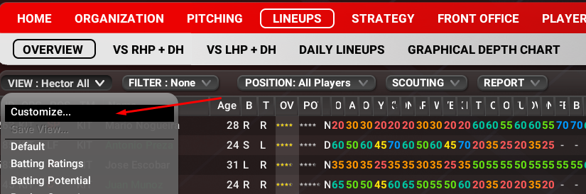

Include all these Data points/Attributes:

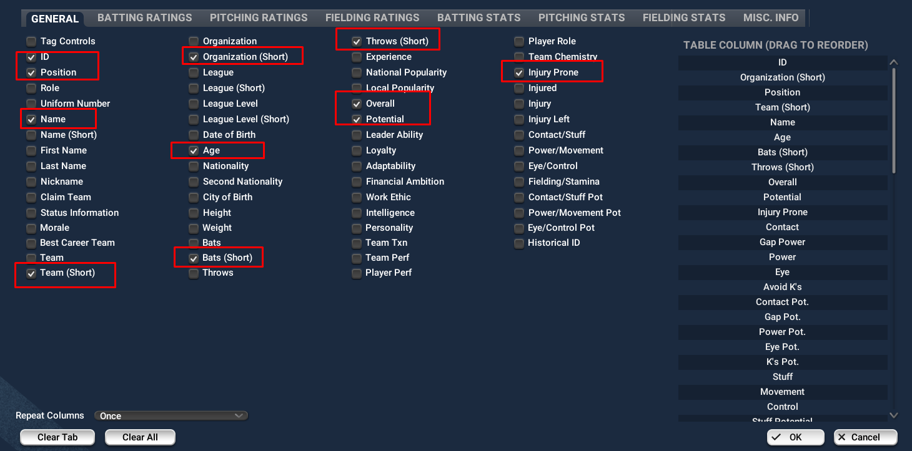


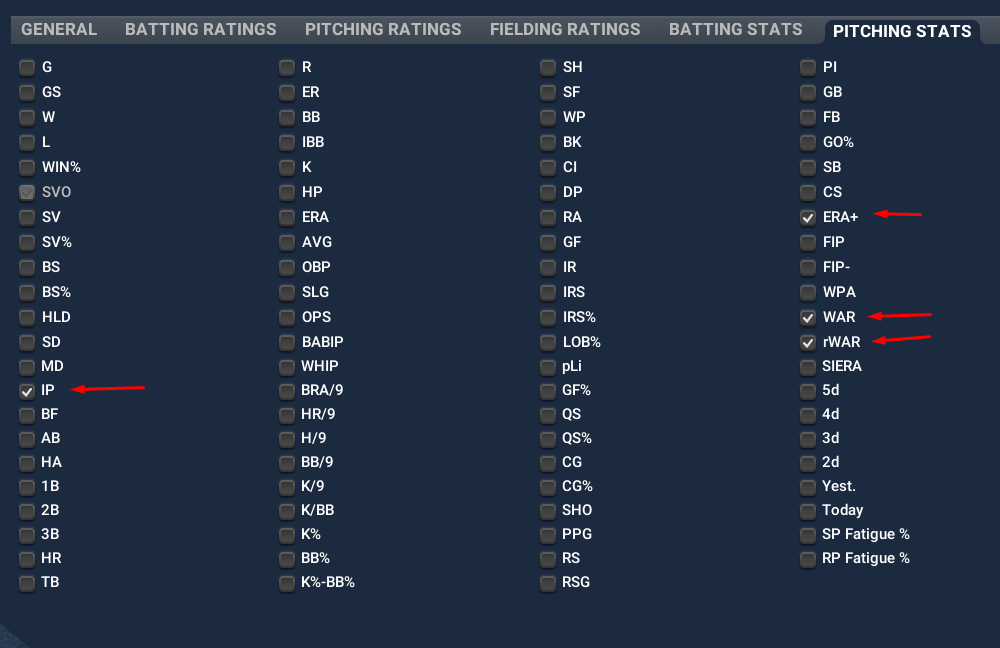

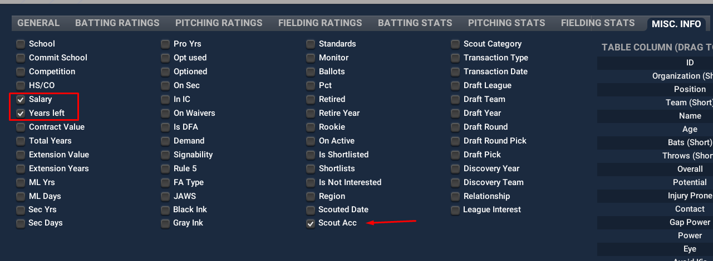

### 3. Save View as Global

- Save the view as **Global**
  
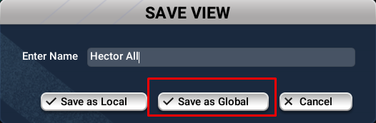
- Name it as **"Hector All"** (or anything you'd like)

### 4. Export HTML File

- Export the report to disk. This will open a browser window, hit save as on the browser page and save as`Player List.html` this is the default for OOTP.

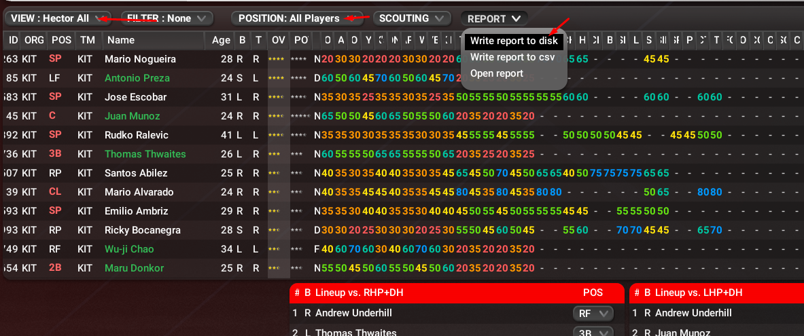
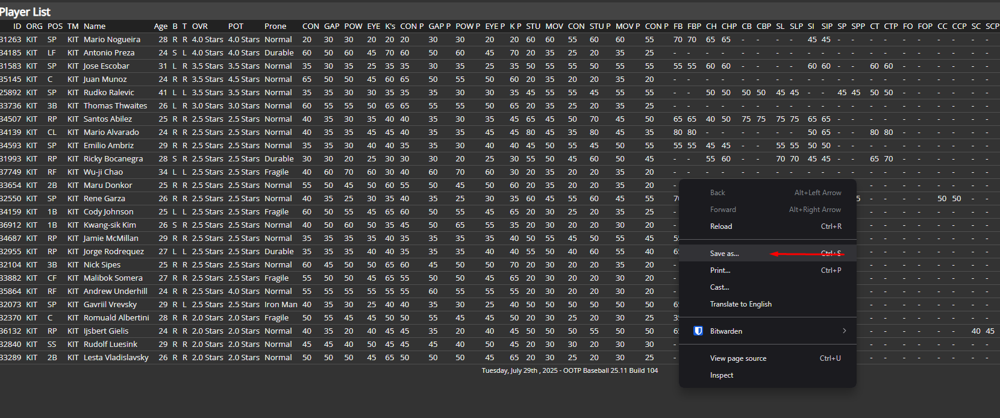

### 5. Replace The Existing File

- Overwrite the `Player List.html` file in your Hector program folder. Restart the program or hit the Reload Button to refresh the data.

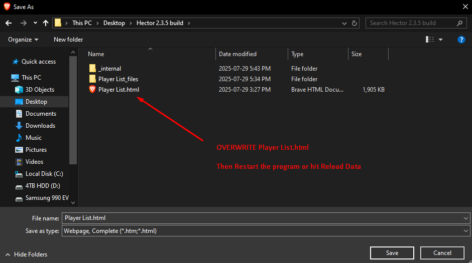

> Tip:
> If you see errors or warnings, check your export views and make sure all fields were included.

### 6. Export Team List (Optional)

For enhanced Trade Finder functionality with team buyer/seller status and park factors, also export the Team List:

1. In OOTP, navigate to **League → Standings** or the Teams view
2. Create a custom view including these columns:
   - `Abbr` - Team abbreviation (required, matches ORG field in Player List)
   - `Team Name` - Full team name
   - `Park` - Stadium name
   - `W`, `L`, `%` - Current record and win percentage
   - `GB` - Games back in division
   - Park factor columns (optional):
     - `PF` - Overall park factor
     - `PF AVG`, `AVG L`, `AVG R` - Batting average factors (overall, vs lefties, vs righties)
     - `PF HR`, `HR L`, `HR R` - Home run factors
     - `PF D` - Doubles factor
     - `PF T` - Triples factor
   - `lyW`, `lyL`, `ly%` - Last year's record (optional, for trend analysis)
3. Export to disk and save as `Team List.html` in the same folder as `Player List.html`

**What Team Data Enables:**
- **Trade Finder**: Shows team buyer/seller status to identify better trade targets
- **Park Factors**: Context for player evaluation (e.g., home run suppression in pitcher parks)
- **Team Status**: Automatic classification as buyer, seller, or neutral based on standings

> **Note:** Team List.html is optional. If not provided, Hector will show a warning and continue with reduced functionality.

---

## Features Overview

### Core Functionality
[⬆️ Back to Top](#top)

- Advanced Calculations
    - Weighted scoring for both pitchers and batters, fully customizable
    - Current vs. potential talent projections
    - Comprehensive total value scores for comparison
    - **Draft Comparison Mode**: Toggle to emphasize potential (1.5x) over current performance (0.9x) for prospect evaluation

- Scouting Details
    - Injury proneness (Durability/Prone)
    - Scout accuracy confidence
    - Player handedness (throw/bat)
    - Pitcher velocity, repertoire count, ground/fly ball ratio
    - Enhanced statistical support: OPS+, wRC+, ERA+, WAR (Batter), WAR (Pitcher), rWAR, SLR, YL, CV

### User Interface Features
[⬆️ Back to Top](#top)

- Filtering & Navigation
    - Easy position-based filters (SP, RP, all batting roles)
    - Infield/Outfield group toggles for mass selection
    - Double-click player names to open their Stats+ league page (configurable via config file)
    - **Smart stat-based filtering**: OPS+, wRC+, WAR for batters; ERA+, WAR, rWAR for pitchers with age ranges

- Smart Search
    - Filter by team (`ATL` etc.), position, and age (e.g., `<30`, `>25`)
    - Chain filters (e.g., `ATL 2B <30`)

- Intelligent Highlighting
    - Flags RPs with 3+ pitches and stamina ≥50 as SP candidates
    - 1B who qualify at 3B: Range ≥50, Arm ≥55, Error ≥45
    - 2B meeting criteria for SS training: Range ≥60, Arm ≥50, Error ≥50, DP ≥50
    - Tooltips explain all highlight rules
    - Dynamic column display showing only relevant stats based on player position

### Reporting and Analysis Tools
[⬆️ Back to Top](#top)

- Quick Reports
    - Top 10 batters at each position
    - Top 20 pitchers (per SP/RP)
    - Batters with ≥50 at secondary positions can be included with one click
    - All data columns sortable ascending/descending

- Team Evaluations
    - See each team's SP/RP current & potential scores, combined pitching, offense, defense, and total rating

- **Trade Tool** (v2.3.5+)
    - Player search with autocomplete for pitchers and batters
    - Team A vs Team B comparison with value totals
    - Score normalization between pitchers and batters for fair comparison
    - Draft pick support with configurable league settings (28 teams, 20 rounds default)
    - Dynamic draft pick value calculation with exponential decay
    - Trade summary comparing total values
    - Player removal functionality

- **Contract Tool** (v2.3.5+)
    - Player selection and comparison to similar players at their position
    - Contract suggestions based on comparable salaries and values
    - Stat-based filtering with age ranges
    - Position filters with "Compare to all batters" option
    - Excludes players with 0 games (batters) or 0 innings pitched (pitchers)
    - Displays Games (G) for batters and Innings Pitched (IP) for pitchers

### Dataset Overview
[⬆️ Back to Top](#top)

- At-a-Glance Stats
    - Total and breakdown counts by role and position
    - Average scores for SP, RP, and batters
    - Visual display of positional talent spread

### User Assistance
[⬆️ Back to Top](#top)

- Hover tooltips for every calculated metric
- Click **Reload Data** to refresh at any time
- Inline help and error warnings if data is missing
- **Draft Comparison Mode tooltip** explaining prospect evaluation functionality

---

## Calculation Flowcharts
[⬆️ Back to Top](#top)

<details>
<summary><strong>Pitcher Score Calculation Flowchart</strong></summary>


</details>

<details>
<summary><strong>Batter Score Calculation Flowchart</strong></summary>

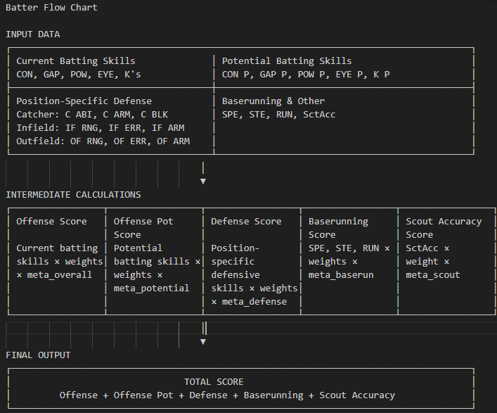

</details>

<details>
<summary><strong>Team Score Calculation Flowchart</strong></summary>

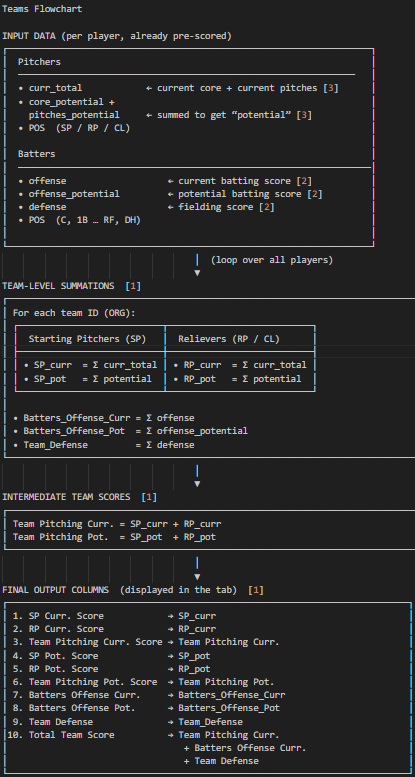

</details>

---

> For issues, guidance, or detailed explanations, explore the program's tooltips or consult the full documentation.

Thank you for using Hector!
