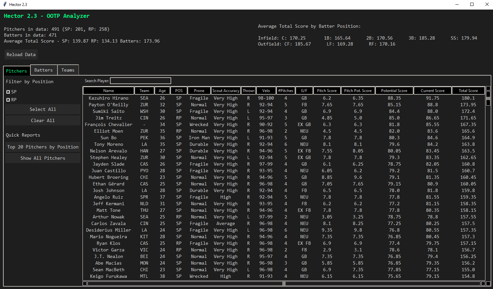
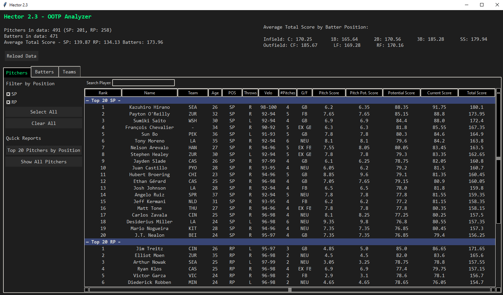
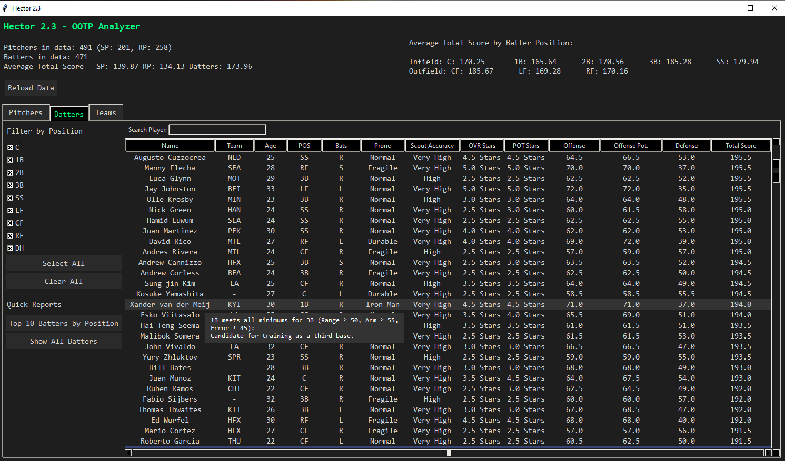
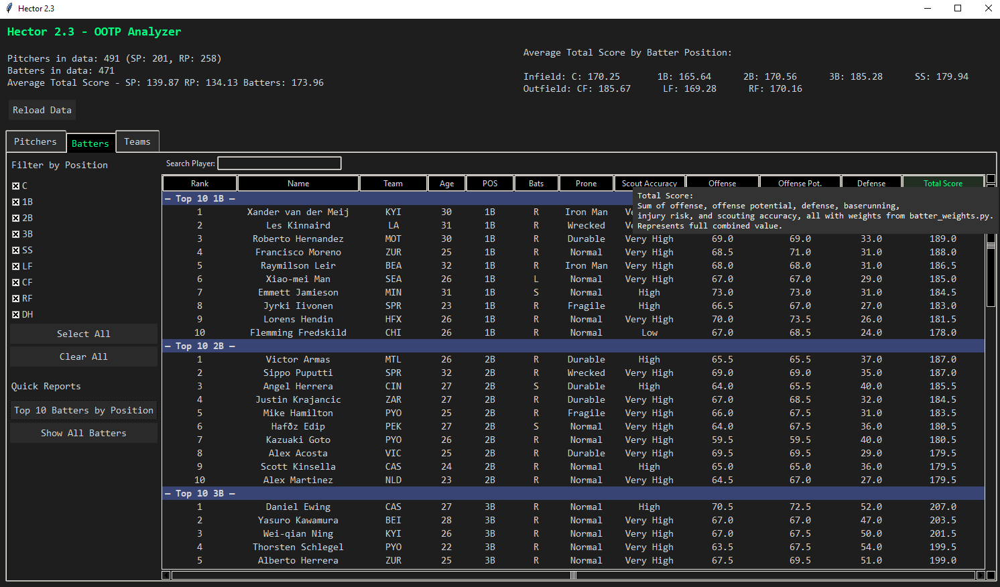
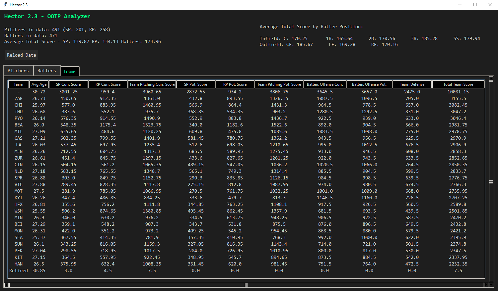
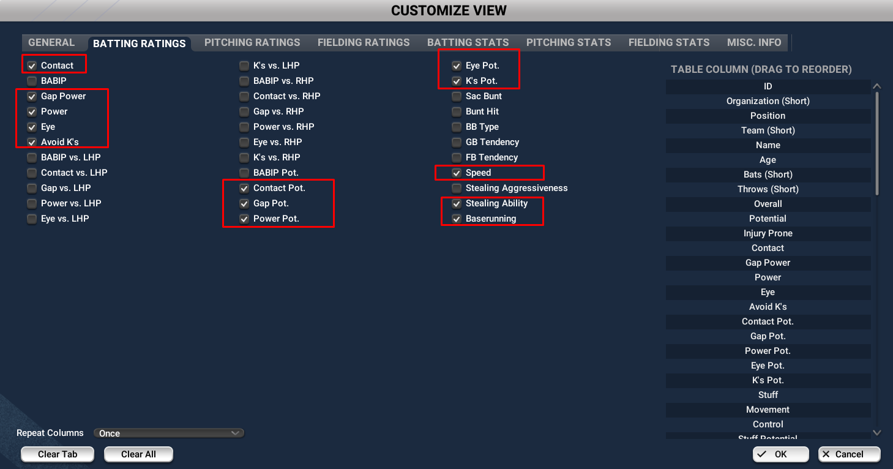
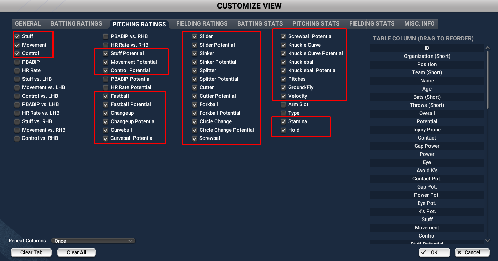
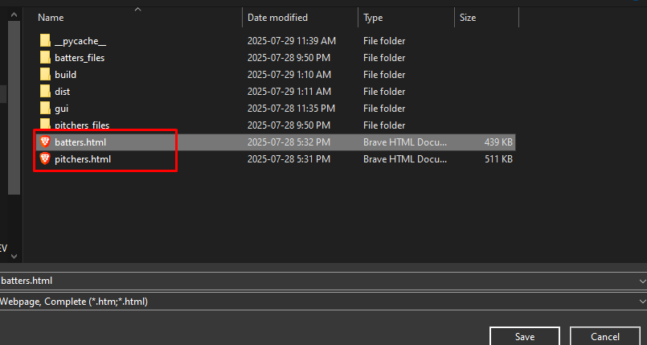

# ⚾ Hector OOTP Analyzer

Hector is a powerful, fully customizable desktop analytics tool for Out of the Park Baseball (OOTP) leagues. Using a clean and modern dark-mode interface, Hector quickly imports exported HTML data and delivers a deep statistical breakdown of every player and team in your league. From customizable scoring formulas and sortable reports to intelligent player highlights and direct Stats+ integration, Hector transforms OOTP exports into actionable insights for both casual GMs and competitive online leagues. Whether you’re rebuilding, targeting trades, or looking for hidden gems, Hector gives you the tools to evaluate, filter, and compare player and team performance—your way.

---

## 🚀 Table of Contents

- [⬇️ Downloading the Latest Version](#downloading-the-latest-version)
- [⚙️ Flexible Weighting System](#flexible-weighting-system)
- [📥 Hector Data Export Instructions](#hector-data-export-instructions)
- [✨ Features Overview](#features-overview)
  - [🧮 Core Functionality](#core-functionality)
  - [🖥️ User Interface Features](#user-interface-features)
  - [📊 Reporting and Analysis Tools](#reporting-and-analysis-tools)
  - [📈 Dataset Overview](#dataset-overview)
  - [🆘 User Assistance](#user-assistance)
- [🔗 Calculation Flowcharts](#calculationflowcharts)

---

## ⬇️ Downloading the Latest Version&nbsp;&nbsp;[⬆️ Back to Top](#top)

You can always grab the newest build of Hector from the **Releases** page:

➡️ [**Download the latest version here**](../../releases)

1. Download the ZIP for the latest release.  
2. Extract it to a folder of your choice.  
3. Run the executable (or use Python if running from source).

<strong>🎬 Showcase: Click to view screenshots of Hector in action</strong>

 
 
 

---

## ⚙️ Flexible Weighting System&nbsp;&nbsp;[⬆️ Back to Top](#top)

**Editing Player Weights**

- `pitcher_weights.py`: Set importance of pitching attributes  
- `batter_weights.py`: Set importance of hitting/defense/baserunning

**How to adjust the weights:**

1. Open either `pitcher_weights.py` or `batter_weights.py` in a text editor (preferably Notepad++ or Visual Studio Code).
2. Modify the numeric values in the `section_weights` dictionary — higher values give more importance to that attribute.
3. Save these files in the program folder where the `.exe` is located.
4. Hit the **Reload Data** button in the program.

---

## 📥 Hector Data Export Instructions&nbsp;&nbsp;[⬆️ Back to Top](#top)

To ensure Hector works correctly, you need to export player data from OOTP with custom views for Batters and Pitchers using the specified attributes. Follow these steps carefully:

- **Data Import Process**
    - Create separate OOTP views for pitching and batting
    - Export both as HTML
    - Replace `pitchers.html` and `batters.html`
    - Click **Reload Data** for instant updates

### 📝 1. Create the Batters View&nbsp;&nbsp;[⬆️ Back to Top](#top)

Include all the attributes shown in the following screenshots exactly as displayed:

  
  
  
  
  

### 📝 2. Create the Pitchers View&nbsp;&nbsp;[⬆️ Back to Top](#top)

Include all the attributes shown in these screenshots exactly as displayed:

  
  
  

### 💾 3. Save Views as Global&nbsp;&nbsp;[⬆️ Back to Top](#top)

- Save each view as **Global**.
- Name them **"Hector Batting"** and **"Hector Pitching"** (you can replace "Hector" with any preferred name).

### 💾 4. Export HTML Files&nbsp;&nbsp;[⬆️ Back to Top](#top)

- Export the Batters view as `batters.html`  
- Export the Pitchers view as `pitchers.html`

  
  
   

### 🔁 5. Replace Existing Files&nbsp;&nbsp;[⬆️ Back to Top](#top)

- Replace the files inside the `Hector` folder with your new `batters.html` and `pitchers.html` files.

> Make sure these steps are followed carefully to avoid missing fields or errors when running Hector.  
> If you encounter any warnings or issues, double-check your export views to ensure all required attributes are included.

---

## ✨ Features Overview&nbsp;&nbsp;[⬆️ Back to Top](#top)

### 🧮 Core Functionality&nbsp;&nbsp;[⬆️ Back to Top](#top)

- **Advanced Statistical Calculations**
    - Pitch Scoring: Individual pitch ratings combined with weighted formulas
    - Offensive Scoring: Batting performance metrics for position players
    - Current vs. Potential Analysis: Separate calculations for present ability and future projection
    - Total Player Value: Comprehensive score combining all relevant attributes for optimal player evaluation

- **Player Information Display**
    - Durability assessment (injury proneness)
    - Scout accuracy from your scout
    - Player handedness (pitchers: throwing hand; hitters: bats)
    - Pitcher specifications (velocity, number of pitches, ground/fly ratio)

### 🖥️ User Interface Features&nbsp;&nbsp;[⬆️ Back to Top](#top)

- **Filtering and Navigation**
    - Position-based filtering: Dedicated checkboxes for starters, relievers, and all batter positions
    - Grouped Position Logic: Infield/Outfield group selection with intelligent show/hide
    - Double-Click Integration: Direct links to your league's Stats+ page for player analysis (editable via config file)

- **Advanced Search Capabilities**
    - Team Filtering: Search by organization (e.g., `ATL`, `BOS`)
    - Position Filtering: Filter by roles (e.g., `2B`, `SP`)
    - Age-Based Queries: Use `<`, `>`, `>=`, `<=` for age filtering (`<30`, `>25`, `>=21`)
    - Combined Searches: Multi-criteria support (`ATL 2B <30`, `SP >25`)

- **Intelligent Player Highlighting**
    - Relief-to-Starter Candidates: Relievers with 3+ pitches and stamina ≥50
    - Position Flexibility:
        - 1B who can play 3B (Range ≥50, Arm ≥55, Error ≥45)
        - 2B that could be trained for SS (Range ≥60, Arm ≥50, Error ≥50, DP ≥50)
    - Interactive Tooltips: Detailed explanations for each highlight

### 📊 Reporting and Analysis Tools&nbsp;&nbsp;[⬆️ Back to Top](#top)

- **Quick Reports**
    - Top Performers by Position:
        - Top 10 batters per defensive position
        - Top 20 pitchers by SP/RP
    - Secondary Position Analysis: Batters with ≥50 fielding for non-primary positions (when secondary checkbox on)
    - Sortable Data Views: Columns are sortable, ascending/descending

- **Team-Level Analysis**
    - Team tab shows combined scores for each organization
    - Compare SP/RP current scores, team pitching, SP/RP potential, team pitching potential
    - Offensive production (current and future), defense, and total team score

### 📈 Dataset Overview&nbsp;&nbsp;[⬆️ Back to Top](#top)

- **Population Breakdown**: Number of pitchers and batters (by role/position)
- **Performance Benchmarks**: Average total score by SP, RP, and batter
- **Positional Distribution**: How talent spreads across all defensive positions

### 🆘 User Assistance&nbsp;&nbsp;[⬆️ Back to Top](#top)

- Tooltips on all calculations (hover for explanations)
- Manual data/weights reload at any time
- Interactive help throughout the interface

---

## 🔗 Calculation Flowcharts&nbsp;&nbsp;[⬆️ Back to Top](#top)

<strong>Pitcher Score Calculation Flowchart</strong>

<strong>Batter Score Calculation Flowchart</strong>

<strong>Team Score Calculation Flowchart</strong>

---
> For issues, guidance, or explanations, see the tooltips throughout the program or consult the updated documentation.

Thank you for using Hector!
