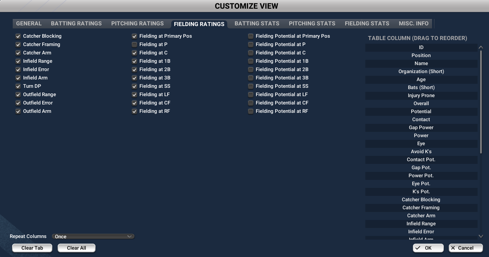

# Hector OOTP Player Analyzer 

Hector is a customizable OOTP (Out of the Park Baseball) program featuring a modern, dark-themed  GUI that analyzes player data from exported HTML files.

## Downloading the Latest Version

You can always grab the newest build of Hector from the **Releases** page:

➡️ [**Download the latest version here**](../../releases)

1. Download the ZIP for the latest release.  
2. Extract it to a folder of your choice.  
3. Run the executable (or use Python if running from source).

---

# Editing Player Weights

Hector’s scoring system is **fully customizable**.  

- Pitcher scoring weights are defined in `pitcher_weights.py`.  
- Batter scoring weights are defined in `batter_weights.py`.  

To adjust how different stats affect player scores:  
1. Open either `pitcher_weights.py` or `batter_weights.py` in a text editor.  
2. Modify the numeric values in the `section_weights` dictionary — higher values give more importance to that attribute.  
3. Save these files in the program folder where the `.exe` is located.  
4. Hit the Reload Data button in the program.

---

# Hector Data Export Instructions

To ensure Hector works correctly, you need to export player data from OOTP with custom views for Batters and Pitchers using the specified attributes. Follow these steps carefully:

### 1. Create the Batters View

Include all the attributes shown in the following screenshots exactly as displayed:

  
  
  
  
  

### 2. Create the Pitchers View

Include all the attributes shown in these screenshots exactly as displayed:

  
  
  

### 3. Save Views as Global

- Save each view as **Global**.  
- Name them **“Hector Batting”** and **“Hector Pitching”** (you can replace "Hector" with any preferred name).

### 4. Export HTML Files
While you can have batters in the pitchers html and pitchers in the batters html it's generally better to make sure after setting your new view, to match the position to the file you're exporting.(Ex. POSITION All Batters when exporting the batters.html)
- Export the Batters view as `batters.html`  
- Export the Pitchers view as `pitchers.html`

  
  
   

### 5. Replace Existing Files

- Replace the files inside the `Hector` folder with your new `batters.html` and `pitchers.html` files.

---

Make sure these steps are followed carefully to avoid missing fields or errors when running Hector.

If you encounter any warnings or issues, double-check your export views to ensure all required attributes are included.

---

Thank you for using Hector!

---

# Planned Improvements

- Show top 10 Potential batters at each position (25 and Under, Offense Potential + Defense)  
- Show Top 10 Potential pitchers at SP/RP (Core attributes potential + Pitch potential)  
- Show top 10 total score for batters at each position  
- Show top 10 total score for pitchers at each position  
- Recommend RP who could move to SP (3 or more pitches, 50 or higher stamina, ranked by score)  
- Recommend 1B who could move to other positions (Range 50 or higher, arm 45 or higher, turn DP above 40, error above 40)  
- Make player page link opening editable
- Error popup for when users accidentally save pitcher data with batters and vice versa to remind users to fix this.
- Imporved readme with better instructions
- Create a Pitcher scores for Current and Potential which then add to total score, like its similarly done for batters(other attributes would be only counted once in current).
- Tool tips explaning what each calculation is( EX. Batters Total score = Offense + Defense = Total score, Pitcher total score is a combination of everything inside pitcher weights - Core atts, core potentials, pitch arsenal current and potentials, other atts, and penalites)
  

---

# Features (Including 2.1 Updates)

## Modern Tkinter GUI
- Dark-themed interface with customized fonts and colors for readability.  
- Responsive tabbed layout with views for **Pitchers**, **Batters**, and **Teams**.  
- Search bars with live filtering and integrated clear ("✕") buttons.  
- Position filters with multi-select checkboxes and quick "Select All" / "Clear All" options.  
- Sortable tables with custom sort logic for special columns (e.g., velocity ranges, durability categories).  
- Visual arrow indicators for sort direction.  
- Row hover highlight for better readability.  
- Double-click player rows to open detailed stats in an external web browser.  
- Manual "Reload Data" button to refresh HTML data and UI without restarting the app.  
- Presented batter position scores in a compact, logically grouped layout, separating Infield and Outfield positions and showing scores by each position. *(Added in 2.1)*  
- Displayed pitcher counts distinctly broken down into Starting Pitchers (SP) and Relief Pitchers (RP). *(Added in 2.1)*  
- Included average total scores for SP, RP, and batters as independent groups. *(Added in 2.1)*  
- Updated filter action buttons (Select All, Clear All) to styled `ttk.Button` components consistent with the main reload button. *(Added in 2.1)*  
- Added age filtering support with comparison operators (`<`, `>`, `<=`, `>=`, `=`), enabling queries like `CAS 1b <25`, `1b <25`, or `1b25`. *(Added in 2.1)*  
- Added a new tooltip explaining the enhanced search and filtering syntax. *(Added in 2.1)*  
- Implemented fully functional and visually improved position filter checkboxes in the Pitcher tab. *(Added in 2.1)*  
- Integrated dynamic, responsive filtering combining position, age, and text search criteria. *(Added in 2.1)*  
- Added vertical and horizontal scrollbars to pitcher and batter tables for improved navigation, ensuring consistent dark theming. *(Added in 2.1)*  
- Enabled automatic sorting on startup by total score in pitchers, batters, and teams tabs. *(Added in 2.1)*  
- General visual and UI improvements (including scrollbars). *(Added in 2.1)*  

## Data Loading & Scoring Features

### Pitchers
- Parses local `pitchers.html` files using BeautifulSoup to extract detailed stats.  
- Uses customizable `pitcher_weights` for weighted scoring of multiple pitching attributes.  
- Calculates total score combining core skills (Stuff, Movement, Control) and their potential scores.  
- Includes individual pitch type scores and potentials (fastball, curveball, slider, etc.).  
- Weights other attributes like number of pitches thrown, velocity, stamina, ground/fly ratio, holds, scout accuracy, overall and potential ratings.  
- Applies penalties for starting pitchers with low pitch counts or stamina.  
- Supports nuanced velocity parsing (e.g., ranges like "90-92 mph" and "+" modifiers).  

### Batters
- Parses local `batters.html` files using BeautifulSoup for comprehensive player attributes.  
- Calculates separate offensive current and potential scores weighted by contact, gap, power, eye discipline, and strikeouts.  
- Computes defensive scores adjusted for position-specific skills:  
  - Catchers: ability, arm, blocking  
  - Infielders: range, errors, arm strength (with emphasis on SS and 3B)  
  - Outfielders: range (prioritizing CF), error rates, arm strength  
- Adds weighting for speed, stealing, running, and scout accuracy.  
- Combines offense and defense into a total player rating.  
- Extracts and displays overall and potential star ratings.  

## Team Scores Aggregation
- Calculates cumulative team stats by aggregating pitcher (SP, RP) and batter scores.  
- Summarizes overall team strength with pitching and batting breakdowns.  

## Modular & Dynamic Design
- Loads data and weighting configurations dynamically from separate modules.  
- Redesigned pitcher and batter weights system for greater customization and dynamic reloading.  
- Enhanced reload button to refresh both HTML player data and updated player weight modules seamlessly.  

## Backend & Architecture Improvements
- Reorganized code for improved lifecycle management placing `root.mainloop()` correctly. *(Added in 2.1)*    
- Defined key callback functions (`update`, `set_all`) before widget creation to avoid scoping errors. *(Added in 2.1)*    
- Modularized tab creation and data loading for easier maintenance and future enhancements.  

---
